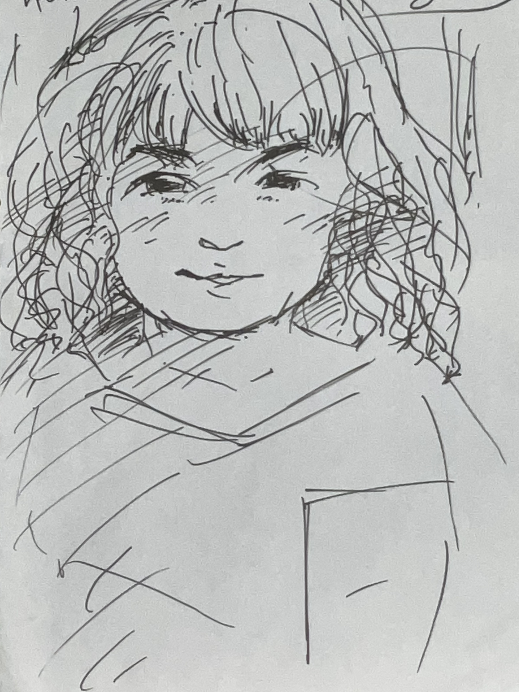

# サイト0831

# 出来事

# 4/27
ウクレレでライディーンを弾いてもらった。うそやん😂
広東語を教えてもらった。今日係幾月幾號？
ノルウェー人とおジャ魔女どれみを歌った。不思議な力が沸いたら何をしよう。鳥とか魚と話したい。でも鳥はまじで話せる人いるんだよな。

# 4/26
干潟に行った。

# 4/25
マハーサシュトラの人と話した。ネパール語をやるのでそのうち話せるようになるかも。アチャールしか知らんけど。

# 最近作ってるもの
[さんまは塩焼き（SUNOサイト）](https://suno.com/s/qcNF5wDiE7b0jV2u)
https://main.vrfsm.pages.dev/?id=cf3df218-c923-4372-8da2-055870bbf33a
[VR-FSM（VRサイト）](https://main.vrfsm.pages.dev/?id=cf3df218-c923-4372-8da2-055870bbf33a)
[小さな規則から生まれる秩序（VRサイト）](https://v-two-alpha.vercel.app/)

# 好き
勅使河原蒼風
假屋崎省吾
公孙龙
鲁迅
老子
ニーチェ
野矢茂樹
落合陽一
陆羽
丿貫
岡倉天心
ジェームス・ブラウン
Audrey Tang
フロイト
ラカン
坂口安吾
ウスタッド・ザキール・フセイン
アララカ
ムッシュかまやつ
川上音二郎
和嶋慎治
だいじろー
水野太貴
项羽
サラディン
矢野顕子
