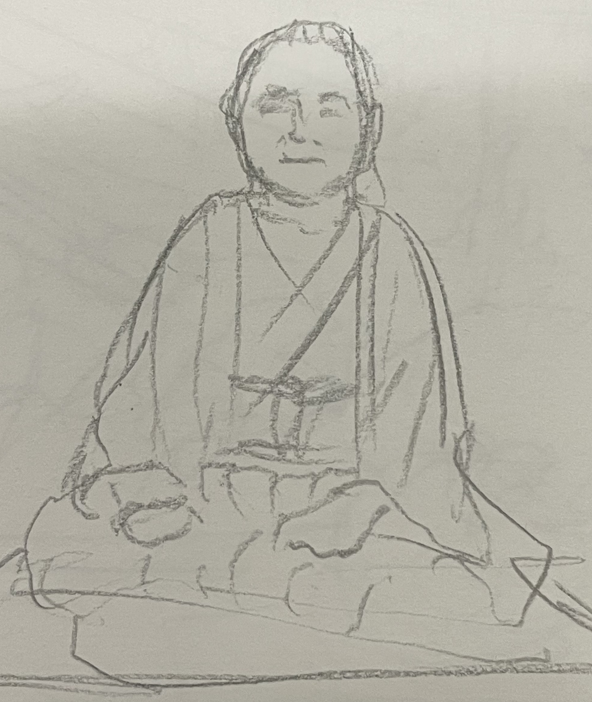

# 7.22
アリアちゃんパーティーなのだが、すごかった。ゲストがすごい。禹周命さんとユジニさんである。そしてすごいのはアリアちゃんの太ももだった。めっちゃ楽しいパーティーになったので・・・って、さんぽ２周年おめでとうってあれいつまで掛かってるのか・・・もしかして次は３周年おめでとうに更新するんじゃないだろうか。カンナムスタイルをぶっ込んだ。ラニカイでパラピリポはやる、って、聞きたかったなー生パラピリポ。あれストピで弾いてたら女の子釣れたんだよね。

# 7.20
今日はトルクメニスタンの人と話した。カスピ海の東だそうで。ロシア語も通じるということで試しにYa Soshla S UmaとかNas Ne Dogonyatとか言ってみたらホントに通じた。カスピ海の西って考えてみたらウクライナか。そりゃロシア圏だわ。

# 7.19
今日はインドネシアの人と話した。心はムスリムだが体はそれぞれ日本人とインドネシア人とそのほか色々多様性があるよね、って話をした。もうちょっとこれ詰めたいところだな。実際はわたしというのも彼というのも記号に過ぎず、実際には体が主に食べ物と水でできているのだが、決してそれだけではない。経験や習慣がそれを作る。

# 7.18
今日もてんこもり。ヌーベルフレンチキュイジーヌとお話しする機会があり、フレンチはブルーチーズとワインだけでいい、なんでああも煮凝り食わしたがるのだ？と聞いたところ、トラッドってそんなもんで、テリーヌ出すのは伝統派でヌーベルはまあやらんとのこと。予想。マリーアントワネット前後がそんな感じで、それをありがたがるというか、換金装置としては優秀ってただそんだけ。日本で言えば江戸料理をありがたがってるみたいな感じかね。アホかという印象。山田浅右衛門だって現代来たら軍靴かバッシュ履くだろうよ。

自衛隊の方とも話したが・・・伏せようこれ。ドイヒーとしか言いようがない。穴掘るしかやることなくて退屈じゃないか？とかジャブを打ったが・・・。

# 7.17
なんか最近左アバラがいてーんだよな、と思い、琉球戦の後か？いつのまに？と思ったら、こないだの靠で自分にまでダメージが行った跡なんじゃね？と思えてきた。内臓に刺さってる可能性があるから、医者に診てもらうかな。でもこんなとこに内蔵ないよね？？？

VRCでいい女に会ったので、正妻になれよ、と言ったらいいよ❤️って言われたので陥落したのはむしろわたしだ。まじでいいけどこっちはおじいちゃんなんで、さすがに年齢差があるぞ。

TMR, デカくなってないか？これ今度のパーティーでやるか。いやこのフォーマットを利用してパーティーを爆発させてもらうぜ.
[TMR講座](https://www.youtube.com/watch?v=Sq8rcoXzNBk)
[現代TMR](https://www.youtube.com/watch?v=Lz24PqZkF2s)

# 7.16
今日は水川さんと入れ違いになりそうになり、サインをおねだりしたら快諾していただけた※掲載許可をいただいております。なお連絡はいつでもつく状態です。問題などありましたらいつでもどうぞ。
[水川蓮](水川蓮.jpg)

朝はめっちゃよく寝た。

昼は前日パキスタンの人が仕事を探していて、手段が派遣だったのでややまずいと思い、高田さん（公人）に相談しようと思った。

そして高田さんのお店でごはんを頂き、その相談をした。ベトナムでも似た問題（勤務はしている）があった。ビザの状態だけは知りたいとのこと。条件が厳しくなっているとか。まあ分かる、というのが正直なところ。

ストピで上海人と盛り上がり、中国での話で盛り上がった。四川での話など。

ストリートピアノをやりにいった。ストピは佐村河内Mk IIという名義で、作曲はAIに任せている。サングラスでぼさぼさの髪でフォルテッシモで弾く。あまりピアノは得意ではない。打撃系が良い。

それからモスクでいつものように掃除。われた蛍光灯などあったので、とりあえず安全な状態にして、管理者にお預けした。そして礼拝。

パキスタンの人がいないので、別のバングラの人に色々話を伺った。交換留学生の方なのだが、勤務は実質３年で、帰国を検討中とのこと。はっきりいって日本としては大損失である。なぜなら彼は聡明かつ人柄の良いイケメンであり、仮に一生を日本で終えたとすると日本としての国益は目算240億程度になる。なにがそうさせたかお伺いしたが、躊躇われた。予想はつく。

んでそろそろバングラって安全よね？って聞いたらそうでもないぜ？とのこと。いやその状態で帰国を検討って・・・

今日のパーティーではサバトと題して聖飢魔II、KISS、矢切の渡し、じょんがら節の鼓、などをやった。

店主が調子が悪そうだったので、どうしたのか聞いたら牛乳が合わなかったそうな。全部吐ききって時間経過で良くなったきたそうな。

# 7.15
アリアちゃんパーティーは北斗の拳で、
welcome to this crazy party. みたいので始めようかね。

デカルト方法序説で我思う、ゆえに我ありって考えうる最悪のように思える。錯誤そのもの。しかし当のデカルト自身は聡明で体術も使えたとあるから、何がなんだか。

シャハーダの意味するところ、それは常に例外がありうるということかと思っている。

# 7.14
ジブリールの声というのは大文字の他者ではなかろうか。

[やはり矢野は偉大である](https://www.youtube.com/watch?v=rLSWjemr8Fo)

アリアちゃんパーティーで歌う歌が決まった。
ワンピースで場を爆発、ひとつだけ、で整えるか。

# 7.13
現代茶道。丿貫流はない。例外として、生きた茶席がある。どこにでもある抹茶碗に冷水を注ぎ、スタンダップで飲む。無論ワンハンド。大傘の下で。この意味がわかる茶人は日本にはない。むしろBook of tea経由でわたしのしらないところで「😂」となっている。

ゆみさんとこで若者が仏教とイスラム教を比較する旨を求めてきたので、珍しいやっちゃと思い、イルイラーハイッラッラーの指示対象とか、それぞれの強み、弱みを話した。

# 7.12
今日は現代茶道ができてとても良い。Lose Yourselfも歌えたし。今後は2PACやDreなんかもやっていきたいと思いStanを聞いたらとてもじゃない。やってみよう。やっぱ無理というものもある。原点に戻ってSlim Shadyでもやるか。なんでLose Yourselfはいけたのか不思議になってきた。多分　Without Meもいける。ちょい練習が要るなこれ。

# 7.11
今日はチェロを弾いた。弓弾き。いきなり弾けるのはバイオリンやってたからなんだなこれが。あんまし弦は得意じゃない。やはり打撃系が良いだろう。

# 7.10
沖縄空手とやったところ、敗北をした。普段敗北を知りたい旨の発言をするが、実は普通に敗北する。特に琉球と少林には勝ったことが経験的にない。まあこっちはなんだかんだで武器レスのときはショーでしかないからねえ。とはいえ琉球の浸透けい（字がでない）がまさか後日来るとは。

# 7.9
旧知旧友、というか沖縄料理屋さんだった人とコンビニで偶然再会し、貫手で肝臓貫かれて膝から落ちて一ヶ月寝ていた話をしたら、実は彼が相当な琉球空手の使い手と発覚し、色々教えてもらった。勝ち筋がない、というところまで納得した。これだから琉球とはやりたくない😂連絡先を交換した。

# 7.8
クイズです。槍の名手と弓の名手、銃の上手いのはどちらでしょう。答えはCMの後。

# 7.7
ウズベキスタンの店長がケバブもやってて大変と聞き、それは食わねばなるまい（我ながらなぜかは知らん）、と思い、行ったら美味かった。サバサンドと、もう一個はなんだったか。生地にソースを塗り、野菜とトマトを散らし、生のレモンを振ったもの。食べ方はおそらく自由なのだが、わたしの場合ロールして食べる、となる。美味い。店主が店員を叱っていたので、甘い、こうだ、と垂直に天を蹴り上げたところ、「お客さんがびっくりするからやめてください」と言われた。これ以上ごもっともなことがあるなら挙げてみて欲しいところだ。

# 7.6
ウズベキスタンのお店にて。なんと三元茶が出てきた。しかもチャイで。これはおもてなしからは同じものが生えるということを意味するのか。あるいは日本文化は十分に知っているということなのか。答えを質問するのは野暮だ。そういえばわたしは抹茶碗を焼いているのだが、なんと彼のお店と意図が同じ名前なのだった。びっくり。

# 7.5
イマームに抹茶をあげようとしたらどうも乗らない。やはりアパルトヘイトが前提らしい。わたしは弓兵を整えるべく、弓道場に通おうと思っている。火曜からだな。モスクはあるだろうか。ちなみに国防は目的ではない。漁夫の利を得るためである。ヤマト共和国とか幻想は言わない。ステートレスステートを構想する。

# 7.3
今日は紙の仕入れ。昨日高利貸しから金を借りたので、さっそく返した。
２：１でケンカを売られたので即買ったところ、逆に引かれる。まれにあるが、
「こいつは相手が多人数で平気なのか？？」となった時点で前提が崩れるらしい。
こっちからすれば素人が束になっても素人なので配慮が要る。

あやさんとこで北斗の拳を歌ったところ、跳ねた。
しばらくは北斗ネタでいこう。ラオウやっかな。

# 7.2
トルコのイスラム学校の校長にお会いした。ムスリムらしい、と言われた。そうなのだろう。

# 7.1
南アメリカの人とVRCでお話しする機会があり、アパルトヘイトは日本で起きつつある、という話になった。原因としては利子にこれはあり、これを死守するために手段を選ばない人は現実にいるのだ、という内容が資本論だ、ということになった。おいおい読もう、話題や人生の糧になるだろう、と言われていた。

久しぶりにはやしさんとあやさんとこへ顔を出す。お元気そうで。東方的威風と好漢歌をやった。

さんぽパーティーも参加した。もちろん東方的威風。ここは爆笑を得たのはいいのだが、コンガの叩きすぎで指が晴れた。しばらく控えよう。

# 6.30
今日はウズベキスタン料理を食べた。ムスリムに服についたパンクズをパンの入った袋に捨てられたので、なんかムスリムってやめたくなってきた。かといって日本人にも愛想が尽きた。サマルカンド。何かしら縁があるんじゃないか？

# 6.29
今日はストリートピアノでカッワーリーを弾いた。アリーカーンはすげえ。勝てる気がしない。負ける気しかしない。だが私は挑む。なんなんだわたしは。成龙かなんかかもしれん。ネパール人に Where you from? と聞いたらネパールと言われ、そして香港かな？と言われたので、我是中国人と答えておいた。何を言っているのか通じまい。
ウズベキスタンのアップルティーを頂いたのだが、これは凄い。ほんとに凄い。今まで飲んでいたアップルティーが正直霞む。
そしてガールフレンドができた。Mashallahとしか言いようがない。これがまた凄い人なのだ。彼女からサモハンキンポーが好きと聞いた。つえーよあいつは。

# 6.28
ストリートピアノでアラビア旋法で演奏
モスク掃除
即興ヒンディスターニーでイマームを笑わせる
モスクメシとカルダモンチャイとおみやげを頂く
カラオケ(さんぽ）で踊ろうとなり、インド古典舞踊と中国舞踊とブレイクダンスを合体させて爆笑をいただく。ここはきっとインド。 トゥルットゥルットゥッダーダーダー
アフガン地政学←今は平和らしい

# 6.24 
モスクで礼拝の後、ネパールカレー屋さんへ。ダルバートを頼む。ムラコアチャールと言ったらやっぱり喜ばれる。意外性があるのだろう。ローカルダルバートを頼む。旨い。チャイを追加しちゃった。

今日(現在25日2時)からラマダンなのである。おにぎり３個。日本米などいつぶりか分からない。

[なぜか描いた青木理](./青木理.jpg)

# 6.23
ムスリムになった。モスクに行くのは911以来。サラーフ・アッディーンとした。わたしはこれを名前が勝っているとも負けているとも思わない。なぜなら、わたしが間違っているなら、正せばいい、つまり、わたしは間違いうる。無謬じゃない。あらためて字にすると当たり前に思われるが、なかなか無謬の人は多い。：

# 6.17
futher lessという言葉が降りてきた。父性欠如症候群。ラカンをひさしぶりに紐解く。確かにそう。言葉が現実に対する機能からただ苦しみしか対象しない状態に移行する。VRCでは菅直人元首相ネタは危険すぎということで、すごいウケたけどyoutubeで放映できないレベルだったので、封印orオープン、ドロー！！モンスターカード！！菅直人。そろそろ自重するか。彼自身はおそらく悪くない。そこそこ優秀なのだが、イエスマンに囲まれれば誰でもああなる。なぜそれが分からないのだろうか。何を言ってもその通りと言われたら現実が溶けてゆく。

そういえばこのページ、イスラエルからもアクセスがあるようだ。ハヴァナギラでも歌おうか？リバーを作った、という印象がつきまとうが、どうなんだろう。おそらくちゃんと調べるとまた違うのだろう。

# 6.16
今日は喫茶さんぽに行った。来週も行こう。攻殻機動隊はどうも残念な結果になりそうだ。具体的にはらんま1/2のような事態になると思わしい。消化試合というか。昨日パームが200円なせいで誰も買えず、ガチガチになったのを棒ごと噛み切った話をしたら結構ウケた。たぶんあっちはyoutubeだろうな。さんぽではシェンヤン人ということで、日本の民謡をぶっぱしてきた。せっかくなんだからガチローカルがいいだろう。広東人に出会ったので「東方的威風」と試しに言ってみたが通じない。広東語のハードルは高いな。

# 6.14
今日はサンゲタンを頂いた。薬膳に近い印象を持っていたが、そんなに人参プッシュしないのね。
最近はクリエイター陣がやりたい放題で良い。原点回帰だな。

# 6.12
今日はFSMの仕様を詰めた。最近は言語はrustしか使っていない。
[やはり矢野は偉大だな](https://www.youtube.com/watch?v=BeVN6pN7lfc)
フォーばっか食ったけどとんでもなく美味い。ハノイはヌーベルシノワだね。ついついカントー系野趣を求めてしまうが、あらためてハノイもいい。

# 6.11
今日は割と環境整備。とか言いつつアプリを一本上げる。
細川一門のカラオケ大会に呼ばれたので、細川たかしをあらためて聴いたら、やっぱ凄い。
無論、カチコミでいく。

# 6.10 水
[藤田って歳を重ねて絵うまくなってないか？](https://www.youtube.com/watch?v=-1MH9I46lYY)。普通漫画家って歳を重ねるほど「絵は描いといて」ってなるものだ。藤田は例外。うしとら期より上手くなってる。

[フーコーの振り子](https://www.youtube.com/watch?v=FeuVbbpokyk)を見た。以前見た時はよく分からなかったが、確かに自転の証明になっているということに気づいた。

であれば大地平面説は成り立たないか、と思ったが、計算上どうとでもなる。

ただもう丸い方が色々シンプルになって良くないか？とは思う。

# 6.9 火
[伊能死す](https://www.youtube.com/watch?v=iQpAnbwJRLI)。やっぱいいよね次回予告って。わたしも日記は次回予告にするか。次回出来事。ユリアの涙は・・・ラオウに、あ、届くのぉかぁぁっ！！

# 6.8 月
起動が36msになった。カーネルとドライバの修正で16msは現実の射程。干潟でボイトレ。夕食はフムスとピダ。中東料理。claudeと中東情勢について話してみたら結構面白い。

# 6.7 日
OSの起動が２秒になった.
0.6秒を目標にする.
あと1400ms.
計645secになった.
まだ増減するが目標値を300msとするか・・・あるいは30msとするか.
おそらくclaudeからすれば狂気の沙汰となろうが、16msを目標としたい.

# 6.5 金
韓国人と歌ったが、良い。「力をもらった」と言われた。そのために歌がある。日本人は「そんな風に歌えない」とか言ってくる。だから日本人とは遊びたくない。

# 6.3 火
今日は歌手の方が友達になった。VRCはやや苦手意識ができつつある。でもエンジンエンジニアとか面白い奴もいるしな。

# 6.1 月
バカンスを楽しんだ。帰ってきたらPC類の電池が空になっていたので、充電。ベトナム料理を始めた。

# 5.28 木
韓国の方が友達になり、息子にしたいと言われたが、ついていけんのはおそらくそっちだ。なにしろわたしより自由の人がいたら連れてきてほしい。いつでも死ぬ覚悟がある、その時点でもう頂点という地平がある。親だから子をどうにかしたいのは傲慢なのだ。かといって放置すれば人を噛み殺す。その塩梅を理解するか否かは大きい。

# 5.27 水
書家の人が友達になった。
[なので上げてみる](./一切皆苦.png)

# 5.26 火
トルコの人と話していくつかトルコ語を習った。なんでその発音ができるのか？と言われ開端章をイマームに習ったと言った。午後ははやしさんとこへ。元気そうだった。１年くらいご無沙汰の方々へ顔を出している。OSはブートシーケンスができた。

# 5.25 月
今日はずいぶんと歩いた。和三盆を買った。抹茶をいただく。抹茶は陸羽に起源があると聞くが、彼は水の質すら比較していたようで、こんなのと勝てる気がしない。日本共産党の人と話した。真面目なことはわかるがあまりにも勉強が足りない。中国すら行ってない。想像上の中国ですらない。しかし足を運んでいることは評価すべきだろう。

# 5.24 日
スプラッシュの方針が決まった。日本は取引先から外す。iTronですらなくなった。VRCでロージアをやろうと思う。ドラムが木曜届くのでドラム＆ボイスをやろうと思う。TOMCAT。欧米日を外す（トルコ除く）のはどうかと思われるかもしれない。しかし本当にお世話になっているのはそれ以外だと思うのだ。

# 5.23 土
カーネルの方針が決定した。iTronとLinuxのハイブリッド。VRCは不調。今日もハルミさんに会えた。かなうさんの絵を押し花を使って描いた。下絵はできたので、アクリルペイントしていこうと思っている。

# 5.22 金
久しぶりにハルミさんに会った。押し花界の大御所。こういう人に会うと生きてるって楽しいと思う。

[欧米を相手にする気は基本的にはないんだが](アクセス.png)

# 5.21 木
国産true blackみたいなものを手に入れた。true blackより黒いのかな？

# 5.20 水
久しぶりに人物をモデルに絵を描いた。クリムトなんか見てなかなか良かった日だった。

# 5.19 火
VRCの沖縄ワールドでハイサイおじさんとかマタハーリヌ・ツンダラカヌシャマヨ、とかやりたい。練習はしない。常時本番である。ガチ三線の音はおそらく沖縄人は分かるので、「本土人がなぜゆえ！？！？」ときっとなる。チューニングはやっとくべきだろうな。視界ないし。

# 5.18 月
カホンを手に入れた。音はまだ慣れていないので、かなり慣らしがいるような気がしている。OSの都合で[アショーカ王の碑文](https://picryl.com/topics/brahmi+script/ashoka)を見た。そんなわけでOSの名前は𑀩𑁆𑀭𑀸𑀳𑁆𑀫𑀻となる。作者すら読めない。

𑀅 𑀆 𑀇 𑀈 𑀉 𑀊 𑀋 𑀌 𑀍 𑀎 𑀏 𑀐 𑀑 𑀒
𑀓 𑀔 𑀕 𑀖 𑀗
𑀘 𑀙 𑀚 𑀛 𑀜
𑀝 𑀞 𑀟 𑀠 𑀡
𑀢 𑀣 𑀤 𑀥 𑀦
𑀧 𑀨 𑀩 𑀪 𑀫
𑀬 𑀭 𑀮 𑀯
𑀰 𑀱 𑀲
𑀳
𑀴
𑀸 𑀺 𑀻 𑀼 𑀽 𑀾 𑀿 𑁀 𑁁 𑁂 𑁃 𑁄 𑁅
𑀀 𑀁 𑀂 𑁆
𑁇 𑁈 𑁉
𑁒 𑁓 𑁔 𑁕 𑁖 𑁗 𑁘 𑁙 𑁚 𑁛 𑁜 𑁝 𑁞 𑁟 𑁠 𑁡 𑁢 𑁣 𑁤 𑁥

# 5.17 日
OSを比較的進められた。ARM系。名前は梵天としよう。みみかきのふわふわ。なんであれ梵天なんだろうな？

# 5.16 土
今日は25kgかついで1km歩くわ鎌を振り続けるわでなかなか大変だった。金ちゃんにドライバーを貰っちゃった。アプリはちょい進めた。py系（嫌い）だけどライブラリ必須なので・・・というかクラウド前提だし、なんとかならんのだろーか。

# 5.15 金
トルコ式コーヒーを淹れてみた。これこそがコーヒーという味。店員さんが砂のやつやりたいって言っていたが、私は可能に思う。が、公式が直火でいいと言うので、どうすべきか。

# 5.14 木
今日はハヴァ・ナギラを合唱した。ベトナム食材店で色々買い物してたらラーメン５パックおまけしてくれた。まじかよ。いつかカントーは行きたいんだよな。イマームに「サラディンっていいよね」って言ったら「誰？」って言われた件を「サラーフ・ヒッディーンって言わないと通じない可能性が高い」と言われ、やっぱ９１１の直後だったし軍関係は伏せたいのかなと思っていたのだが、そうじゃなくて単に通じなかった・・・あのイマームが！？とも思うがお茶目なとこもあったしありうる。いやそんなバナナ。

# 5.13 水
今日は哲学の質問を受けたので、公孫竜からの構成論理みたいなことをやった。A|!Aは成立しうるみたいな論理感。逆にA|!Aが成り立たない時はどういう時か、みたいな。

# 5.12 火
揚輝荘に行った。大した画家だよ祐民さんは。帰りに不老園に行き書の謎を解いた。店主は「知らなかったです」と。気分はハンマーカンマーだがまあ・・・その・・・伏せておこう。茶会として成立させる書など久しいのではあるまいか。

# 5/11 月
OSは割と順調に進みつつある。x86とarm並行で進めている。RISC-Vも視野に入れるかどうか。

# 5/10 日
パキスタン料理店でマトンパラクとロティとマンゴージュースを頂いた。非常に美味い。VRCで平和とは具体的に観測可能な日常であって万人による万人への戦争（を防ぐための暴力としての法と暴力云々）ではないという話があり、わたしはそれを肯定可能である。具体的には政権は道具であって目的ではないという態度になると思わしい。

# 5/9 土
水張りに再トライ。今度は成功。

# 5/8 金
スキレットを買った。育てていこうと思う。ドラヴィダは深いというか、ミリンダ王問経とつながってたりするのでビビる。と思いながらTAPAL DANEDARでチャイをいれた。

# 5/7 木
熱田神宮に行った。荒巾木像があったのでスケッチ。昔から不思議な形と思っていた。良く見ると泣いてるし、手足を切られた人間の像に見えてきた。ひさしぶりにギターの弦を張り替えた。１２フレットがズレてるのでコマで調整しようと思う。

# 5/6 水
パキスタンというかハラル食材店に行って色々買った。入る時扉が開いていたのでお会計をしてから「閉めたほうがいいですか？」と言ったら？という顔をしていたのでShould I close it?と聞いて互いにThank youと言った。ローズウォーターを買ったので、マキネッタに添えた。知らない味がした。

# 5/5 火
電車がすしづめだったので、徒歩を選んだ。文脈なき芸術とは何か、という命題を立てた。現前である、と置いた。Claudeが現前とはと問うので、主に地面と空と答えた。久しぶりに絵を描くので水張りをしてい・・・たら破れた。が、構わず続行。張れるか検証する。ギターの１２フレットが合わないのでとりあえず弦を変えることにする。おそらく弦高調整が要る。VRCでノースカロライナ人とsex machineを歌った。

# 5/4 月
朝、薔薇の香りを浴びる。ジャガビーでエスプレッソを飲む。
おちょぼ稲荷に連れて行ってもらった。帰りに美術品の展示をやっていたので見ていたのだが非常に良い。美術品の基準とは何か、となったので、その時は答えを保留にしたが、情報量またはエントロピーで定義できると思う。であれば明らかに美術品外も含まれるじゃないか、と思われるかも知れない。cpersonaを試すもうまく動かない。zennだけ買うか。。。

# 5/3 日
ミャンマーフェスに行った。1000人くらいいたんじゃないかな。わたしは平気で混じるのだが、あんまり日本人がいない。面白いと思うんだけどな。VRCではレンブラント好きな人がいた。

# 5/2 土
今度野点をしようと思い、お菓子屋さんに和三盆を仕入れつつ勉強がてら和菓子とお抹茶をいただいた。最近のお菓子屋さんは攻めてて良い。

# 5/1 金
電ドラとサックスを吹いた。サックスは初めて。楽しい。最近はVRCでキャッチボールをしている。オタマトーンガチ勢がいた。

# 4/30 - 木
ネパール産アタとスリランカ産クミン、マスタードシードとマスタードオイルを手に入れた。チャパティとダルカレー、アチャールを作った。美味い。店主が白いアタあるよ？って聞いてきた。黒い方がいいと答えた。深い意味があるのだろうか。

# 4/28
最近の学生さんは学習エンジン自分達で書くんだな。すげー時代だ。わたしもなんか学習エンジン組んでみっかな。画像が概念と一致するかどうかの判定なわけだから・・・結果から考えれば例えばツツジはツツジと認識されてるから、ある程度可能なわけだ。予想。形を特徴量として、一致度を弾き出して、最も高い確率のものを採用してるんじゃないか←間違ってる可能性ある。metalで掘ってみるか。

中国の人と話した。項羽ネタ行けるんじゃないだろうか。けっこーな確率で歴史わかんねーってなるんよな。竹内亮に会ったことがある、はいけるんじゃないか？・・・陳小濤の変面を歌うのがいいかもしれん。

機械学習の記述法は圏がよさげ。

# 4/27
ウクレレでライディーンを弾いてもらった。うそやん😂
広東語を教えてもらった。今日係幾月幾號？
ノルウェー人とおジャ魔女どれみを歌った。不思議な力が沸いたら何をしよう。鳥とか魚と話したい。でも鳥はまじで話せる人いるんだよな。

# 4/26
干潟に行った。

# 4/25
マハーサシュトラの人と話した。ネパール語をやるのでそのうち話せるようになるかも。アチャールしか知らんけど。

